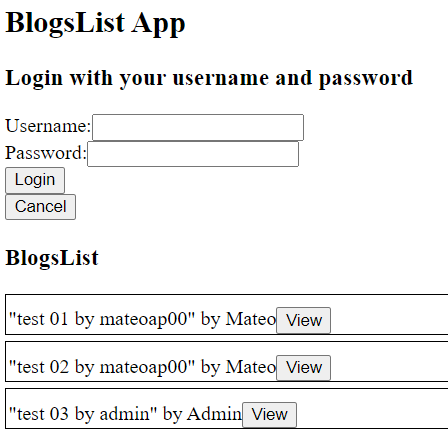
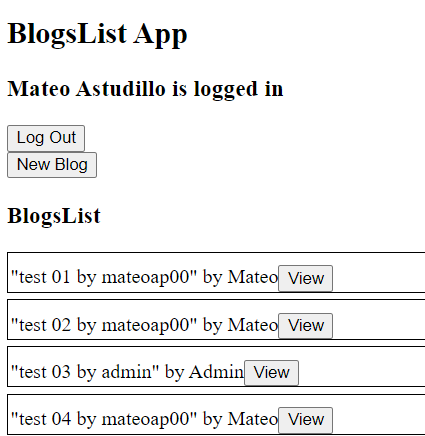
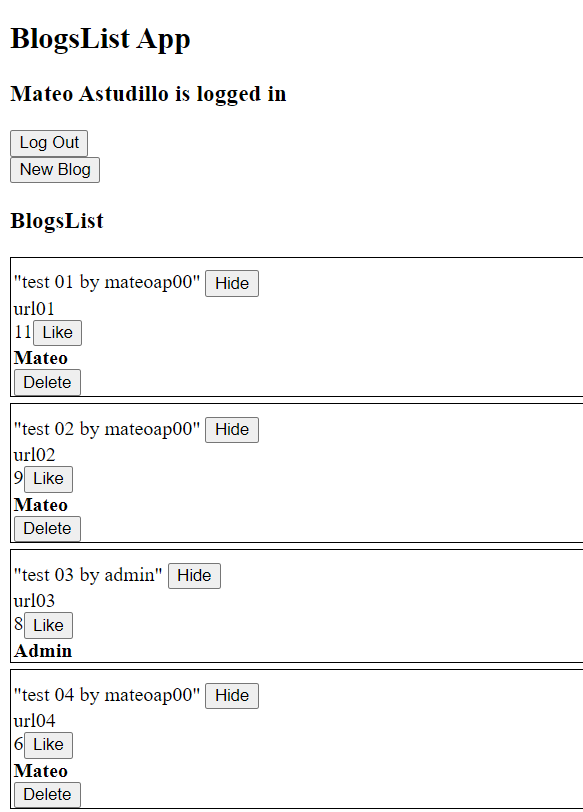
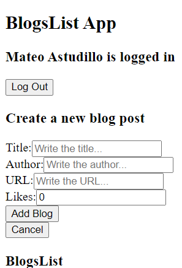
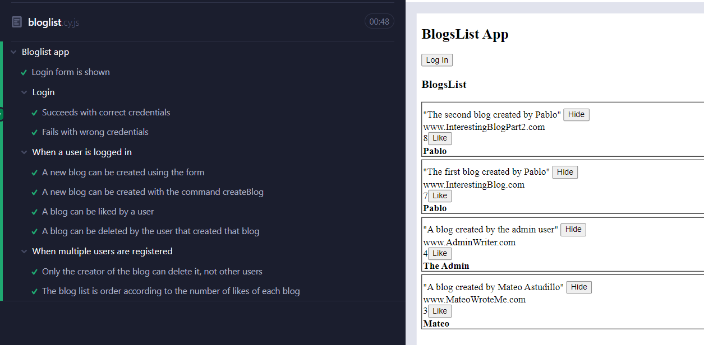

# About Part 5

## The Blog-list Frontend App and Testing
 The Blog-list Frontend App is the final version of the project developed between exercises 5.1 to 5.23.
 This is a frontend React app developed to practice testing in the frontend using Jest, react-testing-library and Cypress for end to end testing. For this app to work the backend Blog-list is needed, this app was developed in part 4 and uploaded to it's own repository at: https://github.com/Mateoap00/blog-list .
 Run "npm start" to start the frontend app and "npm run cypress:open" to run the Cypress tests using the Cypress GUI (open bloglist.cy.js).
 The endpoints of this app are: /api/blogs, /api/users, /api/login.

